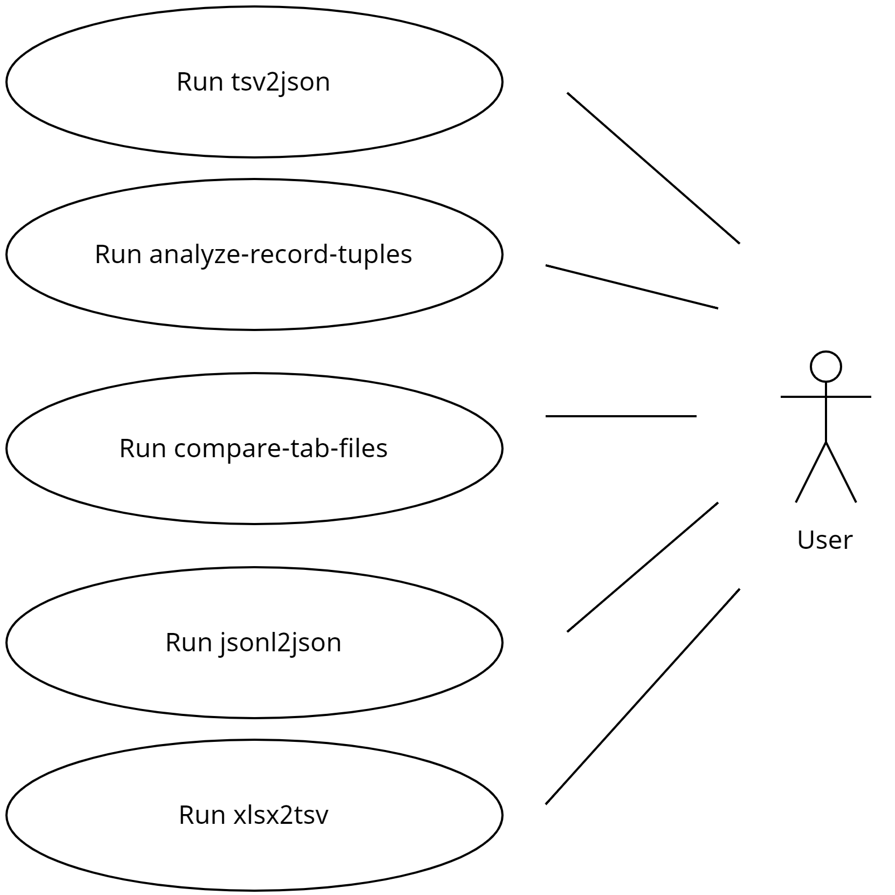

# Data File Utils

Collection of  Python scripts/utils for facilitating file manipulation tasks.

- [Data File Utils](#data-file-utils)
  - [Motivation](#motivation)
  - [Improvements](#improvements)
  - [Use Cases](#use-cases)
  - [Installation](#installation)
  - [Exported scripts](#exported-scripts)
    - [analyze-record-tuples](#analyze-record-tuples)
    - [compare-tab-files](#compare-tab-files)
    - [jsonl2json](#jsonl2json)
    - [tsv2json](#tsv2json)
    - [xlsx2tsv](#xlsx2tsv)
  - [Contributing](#contributing)
  - [To-Do/Coming Next](#to-docoming-next)
  - [CHANGELOG](#changelog)
  - [License](#license)


## Motivation

Explain what the motivation was for developing this package OR<br>
explain how this package was improved after being forked.


## Improvements

Please see the [TODO](TODO.md) for a list of upcoming improvements.


## Use Cases




## Installation

See the install [instructions](INSTALL.md).


## Exported scripts

To use the following exported scripts:
- analyze-record-tuples
- compare-tab-files
- jsonl2json
- tsv2json
- xlsx2tsv
 
### analyze-record-tuples
This script will determine which records are missing from either of the two tab-delimited files. Some specified number of columns will make up the unique tuple
for each line/record.

### compare-tab-files
This script will parse two tab-delimited files and generate a report to indicate which lines and columns are different.

### jsonl2json
This script will parse a JSONL file and write a JSON file for each line in the JSONL file.

### tsv2json
This script will parse a tab-delimited file and write a JSON file.

### xlsx2tsv
This script will parse an Excel file and write a tab-delimited file for each worksheet.

Sample invocation:


```shell
xlsx2tsv --infile ~/projects/experiments/xlsx2tsv/genetics.xlsx 
--config_file was not specified and therefore was set to '/home/sundaram/projects/experiments/xlsx2tsv/venv/lib/python3.10/site-packages/data_file_utils/conf/config.yaml'
--outdir was not specified and therefore was set to '/tmp/xlsx2tsv/2023-12-22-142224'
Created output directory '/tmp/xlsx2tsv/2023-12-22-142224'
--logfile was not specified and therefore was set to '/tmp/xlsx2tsv/2023-12-22-142224/xlsx2tsv.log'
Sheet 'genes' has been written to '/tmp/xlsx2tsv/2023-12-22-142224/genes.tsv'
Sheet 'transcripts' has been written to '/tmp/xlsx2tsv/2023-12-22-142224/transcripts.tsv'
Sheet 'proteins' has been written to '/tmp/xlsx2tsv/2023-12-22-142224/proteins.tsv'
The log file is '/tmp/xlsx2tsv/2023-12-22-142224/xlsx2tsv.log'
Execution of '/home/sundaram/projects/experiments/xlsx2tsv/venv/lib/python3.10/site-packages/data_file_utils/xlsx2tsv.py' completed
```


## Contributing

Pull requests are welcome.<br>
For major changes, please open an issue first to discuss what you would like to change.

## To-Do/Coming Next

Please view the listing of planned improvements [here](TODO.md).

## CHANGELOG

Please view the CHANGELOG [here](CHANGELOG.md).

## License

[GNU AFFERO GENERAL PUBLIC LICENSE](LICENSE)
